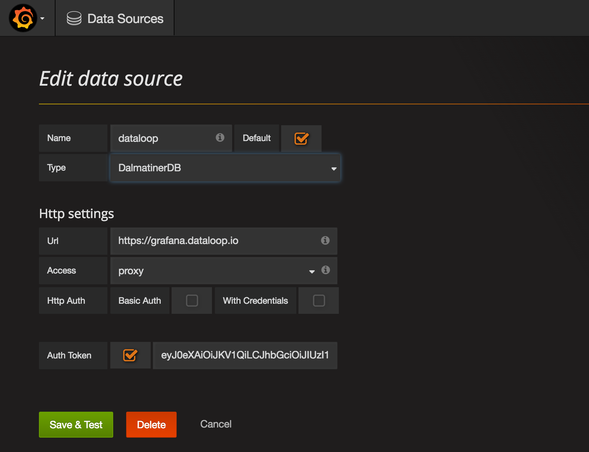
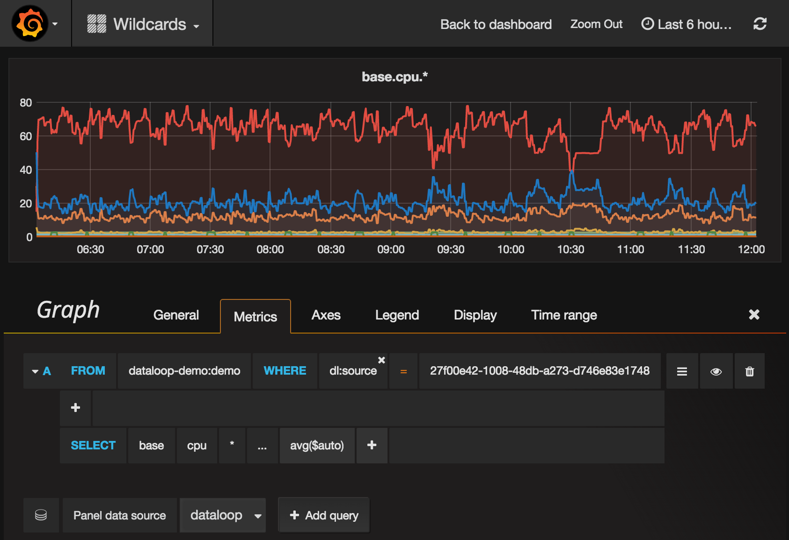

!!! note
    We have recently rebranded and changed our name from Dataloop.IO to Outlyer. Our agent is still called `dataloop agent`, and relevant code reflects the old name (Dataloop) as well. Thank you for your patience as we update everything.

# Grafana

## Grafana 3.0 Plugin

You can add a Dataloop (Outlyer) Agent as a datasource in Grafana by following these instructions. This is especially useful when used with a StatsD server. Install a Dataloop Dataloop (Outlyer) Agent on the StatsD server and use the fingerprint to view all of your StatsD metrics in Grafana.

* Install Grafana 3.0

<http://docs.grafana.org/installation/>

* Add the Outlyer data source

```
#> cd /var/lib/grafana/plugins
#> git clone https://github.com/dataloop/dalmatinerdb-datasource dalmatinerdb
```

* Restart the grafana-server service

```
#> sudo service grafana-server restart
```

* Create an API token

Login to Outlyer and click account settings in the top right corner. Then generate an API token. You may want to create a service user account to restrict access to certain metrics in Grafana. 

* Create a new Data source in Grafana as per below



    * Name: Dataloop
    * Type: DalmatinerDB
    * URL: https://grafana.dataloop.io
    * Access: proxy
    * Auth Token: Ticked, and use the API token from step 4

**Note**: Wildcards in metric paths only currently work within a single fingerprint. This is not a problem for dimensional data (coming from Prometheus plugins) but is required for StatsD. Therefore to use wildcards in metric paths you must always specify a `dl:source` in the `WHERE` clause.


