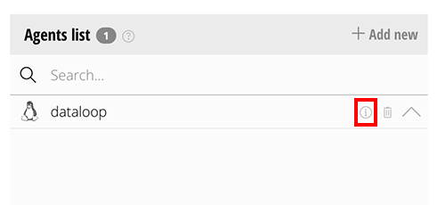
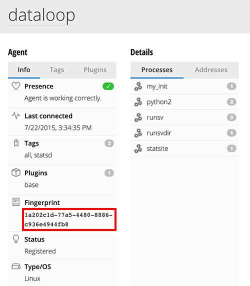

# Hosted StatsD Server

If you are on an enterprise Dataloop plan we'd be happy to manage a hosted StatsD and Grafana 3.0 instance for you. Please contact support to make arrangements.

To use your hosted StatsD server (statsite) simply point your StatsD client at the Dataloop Dataloop (Outlyer) Agent in your account. The server address to use is in the format:

```
fingerprint.statsd.dataloop.io
```

To find your fingerprint log into your account and look for the 'dataloop' Dataloop (Outlyer) Agent on the Setup Monitoring page. Click the little (i) next to it to look up the info.

 


Now on the Dataloop (Outlyer) Agent details page look for the fingerprint of your agent.



In this example we would configure our StatsD clients to send to:

```
1a202c1d-77a5-4480-8886-c936e4944fb8.statsd.dataloop.io
```

On the default UDP port 8125. Your server address will match whatever your fingerprint is set to (fingerprints are unique between agents).

You can then find your StatsD metrics by browsing the Dataloop (Outlyer) Agent or using the statsd tag inside Dataloop.
