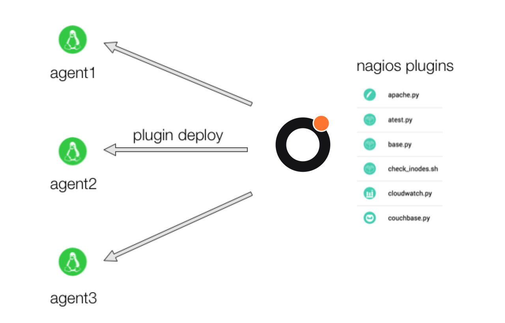
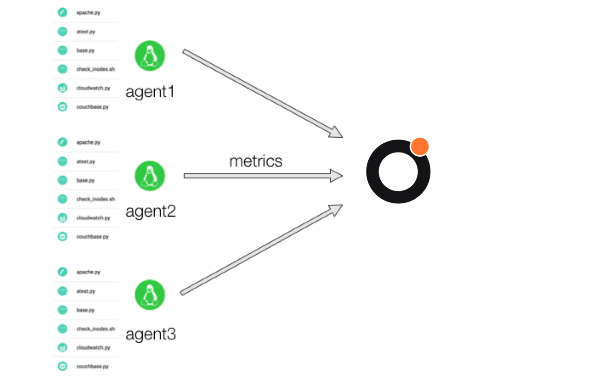

!!! note
     We have recently rebranded and changed our name from Dataloop.IO to Outlyer. Our agent is still called “dataloop agent”, and relevant code reflects the old name (Dataloop) as well. Thank you for your patience as we update everything._

# Plugin Deployment Models

## 1. Default  Mode (centralised configuration)

 

In this model you create your plugins in the Outlyer web UI. They get stored centrally within your Outlyer account and can be edited and tested using our built-in plugin editor. You can add these plugins to either agents directly, or tags of agents, so that they deploy instantly and start returning metrics that can be used on dashboards and in alert rules.

There are two problems this mode solves; firstly, getting adoption so that more people can collaborate on increasing your monitoring coverage, and secondly, reducing the round trip time between knowing what to measure and having those metrics available to use (improving the OODA loop).

 

## 2. Hybrid  Mode (centralised + decentralised configuration)

 

The default mode of operation for the Dataloop (Outlyer) Agent also supports loading plugins from disk. You can still deploy your plugins using the centralised model shown above, and additionally you can also put plugins into `/opt/dataloop/plugins` (or `c:\dataloop\plugins` on windows) so that they get loaded automatically by the agent.

In this mode you get to keep the benefits of the default mode for ad-hoc monitoring but can can use config management as your primary mechanism for determining what agents run what plugins, as well as using your version controlled change management process for deploying them.

 

* In this mode we will never upload the plugins deployed from disk into Outlyer, so they won’t appear in your plugins list. However, the plugins will show as running in the Dataloop (Outlyer) Agent details page. Also, the run button will only ever run plugins written in the browser.
 

## 3. Solo Mode  (decentralised configuration)
 

Solo mode disables the ability to create, test and deploy plugins in the browser. For this mode you will need to use configuration management to deploy your plugins directly into the local plugin directory. These plugins then automatically register inside Outlyer and appear in the Dataloop (Outlyer) Agent details page when running (but never in the plugins list, since they don’t get uploaded to us).

Some benefits to this are that you get to work the way you may always have worked with monitoring tools like Nagios and Sensu. Infact, with Outlyer it’s even simpler than those tools, you simply need to drop plugins into the correct directory and the Dataloop (Outlyer) Agent will automatically run them. You’ll still need to tag your agents as before so that metrics appear in dashboards and alert rules based on those tags work.
 

The advantage of using agents in solo mode over hybrid mode are mostly around security. You can run a mix of solo mode agents alongside default mode agents depending on how you want to manage risk.
